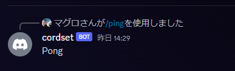
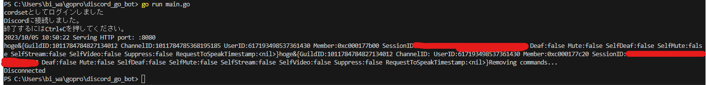

# discord.go多機能Bot+サーバーサイドテンプレート
discordgoを使った多機能Bot+サーバーサイドのテンプレートです。  
httpサーバーの立ち上げ、各機能のハンドラーの登録、コマンドの登録などができます。  
また、データベースにはPostgreSQLを使っていますが、sqlite3に変更することもできます。  
OAuth2の認証もできます。
# 使い方
本リポジトリをクローンして、以下のコマンドを実行してください。
```bash
go mod download
```
その後、.envファイルを作成し、以下のように記述してください。
```env
TOKEN=DiscordのBotのトークン
PGUSER=PostgreSQLのユーザー名
PGPASSWORD=PostgreSQLのパスワード
PGDATABASE=PostgreSQLのデータベース名
PGHOST=PostgreSQLのホスト名
PGPORT=PostgreSQLのポート番号
PORT=httpサーバーのポート番号
SESSIONS_SECRET=セッションのシークレットキー
DISCORD_CLIENT_ID=DiscordのクライアントID
DISCORD_CLIENT_SECRET=Discordのクライアントシークレット
FRONTEND_URL=フロントエンドのURL
SERVER_URL=サーバーのURL
SESSIONS_NAME=セッションの名前
COOKIE_DOMAIN=クッキーのドメイン
```
sqlite3を使う場合は、```main.go```の
```env
dbPath := env.DatabaseType + "://" + env.DatabaseHost + ":" + env.DatabasePort + "/" + env.DatabaseName + "?" + "user=" + env.DatabaseUser + "&" + "password=" + env.DatabasePassword + "&" + "sslmode=disable"
```
と
```
db, err := db.NewPostgresDB(dbPath)
```
をそれぞれ
```
dbPath := ".sqlite3/todo.db"
```
```
db, err := db.NewSqliteDB(dbPath)
```
に変更してください。

# コマンドの追加
```commands```フォルダーにコマンドファイルを追加してください。  
追加後、```main.go```にハンドラーを登録してください。


<details>
<summary>サンプルコード(例:pingコマンド)</summary>
commands/ping.go

```go:ping.go
package commands

import (
	"fmt"

	"github.com/bwmarrin/discordgo"
	botHandler "github.com/maguro-alternative/discord_go_bot/bot_handler"
)

func PingCommand() *botHandler.Command {
	/*
		pingコマンドの定義

		コマンド名: ping
		説明: Pong!
		オプション: なし
	*/
	return &botHandler.Command{
		Name:        "ping",
		Description: "Pong!",
		Options:     []*discordgo.ApplicationCommandOption{},
		Executor:    handlePing,
	}
}

func handlePing(s *discordgo.Session, i *discordgo.InteractionCreate) {
	/*
		pingコマンドの実行

		コマンドの実行結果を返す
	*/
	if i.Interaction.ApplicationCommandData().Name == "ping" {
		if i.Interaction.GuildID == i.GuildID {
			err := s.InteractionRespond(i.Interaction, &discordgo.InteractionResponse{
				Type: discordgo.InteractionResponseChannelMessageWithSource,
				Data: &discordgo.InteractionResponseData{
					Content: "Pong",
				},
			})
			if err != nil {
				fmt.Printf("error responding to ping command: %v\n", err)
			}
		}
	}

}
```

main.go

```go:main.go
    // ハンドラーの登録
	botHandler.RegisterHandlers(discord)

	var commandHandlers []*botHandler.Handler
	// 所属しているサーバすべてにスラッシュコマンドを追加する
	// NewCommandHandlerの第二引数を空にすることで、グローバルでの使用を許可する
	commandHandler := botHandler.NewCommandHandler(discord, "")
	// 追加したいコマンドをここに追加
	commandHandler.CommandRegister(commands.PingCommand(db))  // pingコマンドの追加
	commandHandlers = append(commandHandlers, commandHandler)
```

</details>

以下のような画像のように、コマンドが追加されていれば成功です。


# イベントハンドラーの追加
```bot_handler```フォルダーにハンドラーファイルを追加してください。  
(第二引数に変化が起きるとイベントが発生します。また都合上、onReadyは登録できません。)

<details>
<summary>サンプルコード(例:ボイスチャンネルのステータス変化)</summary>
bot_handler/vc_signal.go

```go:vc_signal.go
package botHandler

import (
	"fmt"

	"github.com/bwmarrin/discordgo"
)

func OnVoiceStateUpdate(s *discordgo.Session, vs *discordgo.VoiceStateUpdate ) {
    fmt.Print("hoge")
    fmt.Printf("%+v", vs.VoiceState)
}
```

bot_handler/handler.go

```go:handler.go
// ハンドラーの登録
func RegisterHandlers(s *discordgo.Session) {
	fmt.Println(s.State.User.Username + "としてログインしました")
	s.AddHandler(OnMessageCreate)
	s.AddHandler(OnVoiceStateUpdate)    // 追加
}

```
</details>

以下のような画像のように、ボイスチャンネルのステータスを受け取れていれば成功です。


# データベースの扱い方
```db```パッケージにデータベースの接続を行う関数があります。  
Botのハンドラーやhttpサーバーのハンドラー内で使用することができます。  

<details>
<summary>サンプルコード</summary>

```db```フォルダ内の```schema.sql```は、データベース接続時に自動で実行されます。
(構文エラーがあると、接続自体ができなくなるので注意してください。)
```sql:schema.sql
CREATE TABLE IF NOT EXISTS todo (
	id SERIAL PRIMARY KEY,
	name TEXT NOT NULL,
	description TEXT NOT NULL,
	created_at TIMESTAMP NOT NULL DEFAULT CURRENT_TIMESTAMP,
	updated_at TIMESTAMP NOT NULL DEFAULT CURRENT_TIMESTAMP
);
```

```"github.com/maguro-alternative/discord_go_bot/db"```をimportすることで、ハンドラー内でもデータベースの操作が可能です。

```go:message_create.go
// messageCreate.go
package botHandler

import (
	"fmt"
	"context"

	"github.com/maguro-alternative/discord_go_bot/db/table"

	"github.com/bwmarrin/discordgo"
)

type PGTable struct {
	SchemaName string `db:"schemaname"`
	TableName  string `db:"tablename"`
	TableOwner string `db:"tableowner"`
}

func (h *botHandlerDB) OnMessageCreate(s *discordgo.Session, m *discordgo.MessageCreate) {
	var pgTables []table.PGTable

	ctx := context.Background()

	fmt.Println(m.Content)
	fmt.Printf("(%%v)  %v\n", h.db)
	err := h.db.DBPing(ctx)
	if err != nil {
		fmt.Println(err)
	}
	err = h.db.CheckTables(ctx, pgTables)
	if err != nil {
		fmt.Println(err)
	}
	fmt.Println(pgTables)

	if m.Author.Bot == false {
		s.ChannelMessageSend(m.ChannelID, m.Content)
	}
}

```

</details>

# OAuth2および認証情報の保存
事前にDiscordの開発者ポータルでアプリケーションを作成し、クライアントIDとクライアントシークレットを取得してください。  
```controllers```フォルダー内の```discord```にOAuth2の認証を行う関数があります。  
```/discord/auth```にアクセスすることで、認証を行うことができます。    
認証が成功すると、```/discord-callback/```にリダイレクトされ、クッキーに認証情報が保存されます。(コールバックURLの設定はDiscordの開発者ポータルで行ってください。)  
認証情報の確認は```/discord-auth-check```で確認できます。

<details>
<summary>Cookieの設定について</summary>

```go:main.go
	var store = sessions.NewCookieStore([]byte(env.SessionsSecret))
	store.Options = &sessions.Options{
		Path:     "/",
		MaxAge:   86400 * 7,
		HttpOnly: true,
		Secure:   true,
		SameSite: http.SameSiteNoneMode,
	}
	// ドメインが設定されている場合はセット
	if env.CookieDomain != "" {
		store.Options.Domain = env.CookieDomain
	}
```

フロントエンドとの接続のため、```SameSite```を```http.SameSiteNoneMode```に設定しています。  
また、```Secure```を```true```に設定するため、httpsでの接続が必要です。  
フロントとサーバーのドメインが同じ場合は、```SameSite```を```http.SameSiteLaxMode```に、```store.Options.Domain```にドメインを設定してください。  
Cookieがファーストパーティー製と認識され、対応ブラウザが増えます。  
(サーバー側のサブドメインも付けておくと良いです。)  
(例:```store.Options.Domain = "aaaaasas.koyeb.app"```)

</details>

# ミドルウエアの追加
```middlewares```フォルダーにミドルウエアファイルを追加してください。
```cors```ミドルウエアはデフォルトで追加されています。(これがないとサーバーとフロントエンドの接続ができません。)

# フロントエンドとの接続
以下のリポジトリを使用します。  
使用技術はReact.ts+Viteです。  

https://github.com/maguro-alternative/discordgo_bot_front  

